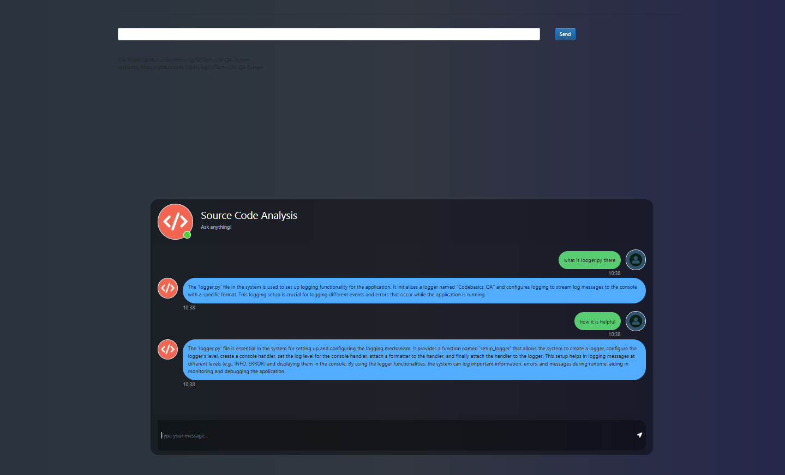

# **End-to-End Source Code Analysis with Generative AI**

This project is an **AI-powered source code analysis web application** built using **Flask**, **LangChain**, and **ChromaDB**. The system enables users to upload source code files and performs **semantic analysis**, including error detection, summarization, and providing refactoring suggestions. It utilizes **ChromaDB** as a vector database for efficient code embedding storage and retrieval, and **OpenAI-powered models** for generating insights about the code.

---

## Demo

Here is a screenshot showing the app's result in action:



## **Features**

- **Upload Source Code**: Upload source code files in various formats (e.g., `.py`) for analysis.
- **Semantic Search**: Perform a semantic search for similar functions or code blocks using vector embeddings.
- **Code Insights**: Generate:
  - Summaries of functions and classes.
  - Error detection and debugging suggestions.
  - Refactoring recommendations for improved readability and performance.
- **Memory Integration**: LangChain's memory ensures conversational continuity, allowing users to query the context of prior interactions.

---

## **How to Run?**

### **STEP 1**: Clone the Repository
Clone the repository to your local machine:

```bash
git clone https://github.com/vishnu-kg/LLM_based_source_code_analysis.git
cd your-repo
```

---

### **STEP 2**: Create a Conda Environment
Set up a virtual environment for the project:

```bash
conda create -n llmapp python=3.10 -y
conda activate llmapp
```

---

### **STEP 3**: Install Dependencies
Install the required libraries listed in the `requirements.txt` file:

```bash
pip install -r requirements.txt
```

---

### **STEP 4**: Set Up API Key
Create a `.env` file in the project’s root directory and add your **OpenAI API key** as follows:

```bash
OPENAI_API_KEY="your-openai-api-key"
```

---

### **STEP 5**: Run the Application
Launch the Flask application by running:

```bash
python app.py
```

---

### **STEP 6**: Open in Browser
Open your browser and navigate to:

```bash
http://127.0.0.1:5000
```

You’ll see the app's interface for uploading files and querying the source code analysis system.

---

## **How to Use**

### **Upload Source Code**
- Navigate to the upload section.
- Upload source code files (e.g., `.py`).
- The app processes the files and stores code embeddings in **ChromaDB**.

### **Query Analysis**
- Use the input field to:
  - Ask for code summaries.
  - Detect potential bugs or issues.
  - Request refactoring suggestions.
  - Perform semantic searches for similar code blocks.

### **View Results**
- Get AI-generated insights directly in the app interface.

---

## **Tech Stack**

- **Python**: Core programming language.
- **Flask**: Web application framework.
- **LangChain**: For integrating OpenAI's LLMs and managing memory.
- **ChromaDB**: Vector database for storing and retrieving semantic embeddings.
- **OpenAI GPT-3**: For code analysis and generating responses.
- **dotenv**: For managing environment variables.

---


## **Example Outputs**

### **Uploaded Code Example**
```python
def calculate_sum(a, b):
    return a + b
```

### **Generated Insights**
- **Summary**: The function `calculate_sum` takes two parameters, `a` and `b`, and returns their sum.
- **Error Detection**: No issues detected.
- **Refactoring Suggestion**: Function is simple and clear; no changes recommended.

---


## **License**

This project is licensed under the MIT License. See the `LICENSE` file for details.
